# Kickstart Vendor Hub — User Manual (Operations)

**Product:** Kickstart Vendor Hub  
**Audience:** Operations staff, field vendors, IT support  
**Document version:** 3.1 — Professional edition (**Karachi** walkthrough with device screenshots)

**Classification:** Internal use. Do not post passwords or PINs on public channels. Redact credentials in screenshots shared outside IT.

---

## Document summary

This manual explains how to install and use the **Kickstart Vendor Hub** mobile app for city-scoped operations: admin dashboards, task creation and management, vendor PIN governance, and vendor-side execution (costs, photos, hold vs complete). Currency examples use **PKR**.

---

## 1. Purpose, scope & audience

**Purpose:** Standardise onboarding for admins and vendors so cities, branches, tasks, and PINs are handled consistently.

**Scope:** Mobile app behaviour for **Admin & operations** and **Vendor portal**. Backend administration, database hosting, and enterprise SSO are out of scope unless your organisation adds them.

**Audience:**

| Role | Use of this manual |
|------|---------------------|
| Operations / admin | Unlock admin portal, switch city, dashboards, tasks, vendor PINs, device password |
| Field vendor | City PIN, My Tasks, task detail, hold/complete |
| IT / support | Credentials reference, troubleshooting, escalation framing |

---

## 2. What this app does

| Portal | Users | Purpose |
|--------|--------|---------|
| **Admin & operations** | Office staff | Pick a city, create and oversee maintenance tasks, review costs and branch totals, manage vendor PINs and (on each device) the admin portal lock. |
| **Field vendor** | On-site contractors | Sign in with a **city PIN**, open assigned tasks, enter costs, attach photos, put work on hold or mark completed. |

The device remembers whether it was first set up as **admin-focused** or **vendor-only** (first-run choice). A **vendor-only** install does not show admin screens.

---

## 3. First launch — how this device is used

When you open the app for the first time, choose the mode that matches how the phone or tablet will be used:

- **Admin & operations** — full back-office features after you unlock the admin portal on this device (when required).  
- **Field vendor** — city PIN sign-in and **My tasks** only.

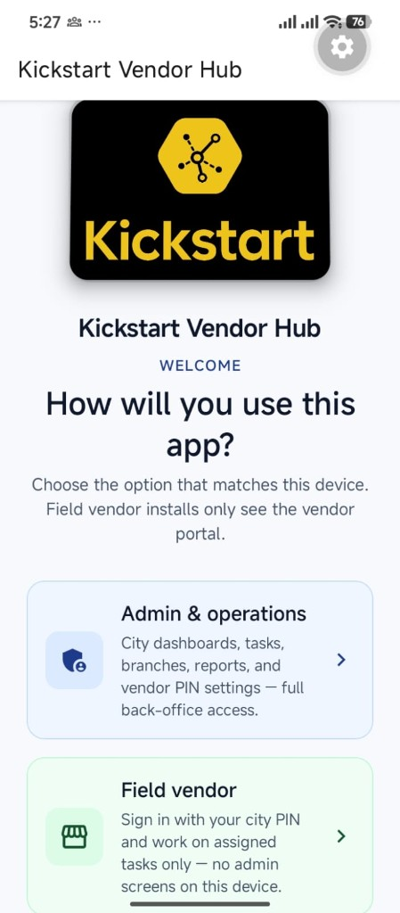

---

## 4. Reference — credentials (this deployment / seed)

These values align with **internal QA/staging** seed data. **Production** may differ; follow IT’s records.

| Role | What it unlocks | Example value |
|------|------------------|----------------|
| **Admin portal device password** | **Admin portal unlock** screen (per device, not the vendor PIN) | `Ksportaladmin1100` until changed under **Admin → Choose city → Admin portal device password** |
| **Karachi vendor portal PIN** | Vendor sign-in for **Karachi** | `1122` (see seed / IT) |
| **Karachi vendor account** | Tasks listed under this vendor in Karachi | `KS_IT_KHI_VENDOR` |
| **Karachi branches (sites)** | Selectable on tasks and filters | VitalFoakh, BRR, Endeavour, Creekside, Mega, Clifton |

If someone changed the admin device password on a handset, use that password instead of the factory default.

---

## 5. End-to-end workflow (overview)

**Admin (typical):** Welcome → **Admin & operations** → admin unlock → **Admin portal** → choose city → Dashboard / Task Management / Create Task → maintain **Vendor PINs** and device password as policy requires.

**Vendor (typical):** Welcome → **Field vendor** or portal picker → **Vendor portal** → city PIN → **My Tasks** → Task detail → **Hold** or **Mark completed**.

Devices set up as admin can still open **Vendor portal** from the portal picker to validate work without a second phone.

---

## 6. Admin path — Karachi (screens follow this order)

### 6.1 Unlock the admin portal

After choosing **Admin & operations**, enter the **admin portal device password** for this phone or tablet, then tap **Unlock admin access**. You are not asked again on this device until app data is cleared or the app is reinstalled (unless your team changes the lock).

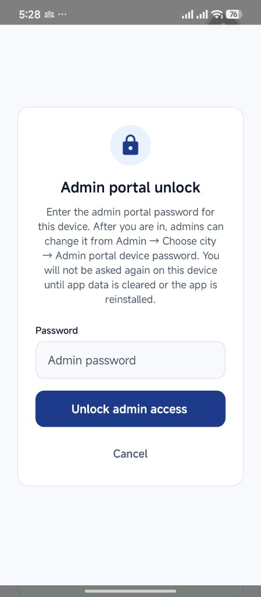

### 6.2 Select portal

Tap **Admin portal** to manage vendors, tasks, and operations by city. **Vendor portal** is used for field execution (see §8).

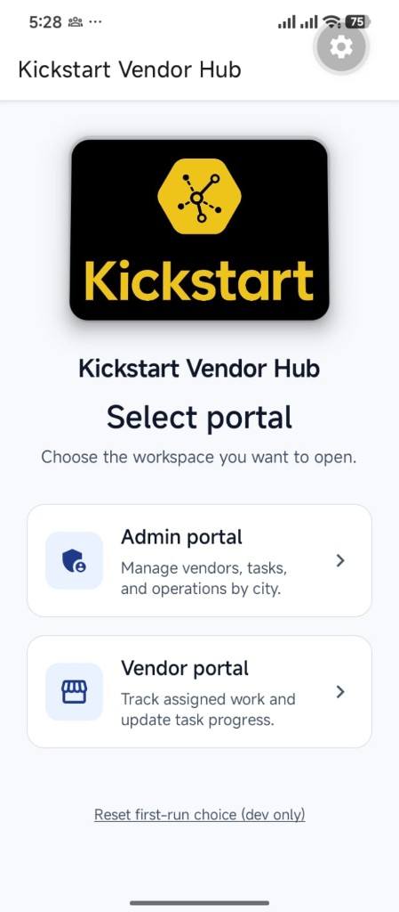

### 6.3 Vendor portal PINs (all cities)

From admin navigation, open **Vendor PINs**. Each city card shows the **generation** and masked PIN; changing a PIN bumps the generation and signs vendors out until they enter the new PIN.

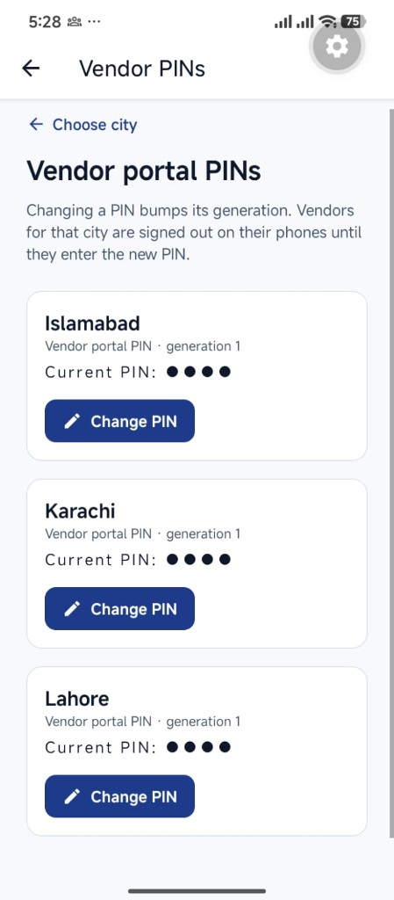

### 6.4 Admin portal device password (optional)

To rotate the **device lock** used at **Admin portal unlock**, use **Admin portal device password**. This is separate from **vendor city PINs**. New passwords must meet the minimum length shown in the app.

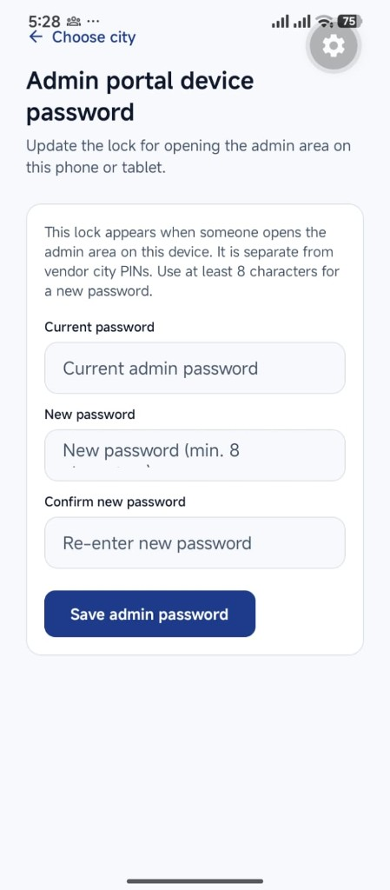

### 6.5 Dashboard — Operations Overview (Karachi)

Open **Dashboard** for the selected city (**Karachi** in this run). Use **Create Task**, **Task Management**, **Switch city**, or **Logout** as needed. Summary tiles show totals such as **Total**, **Completed**, **Pending**, and **On Hold** tasks.

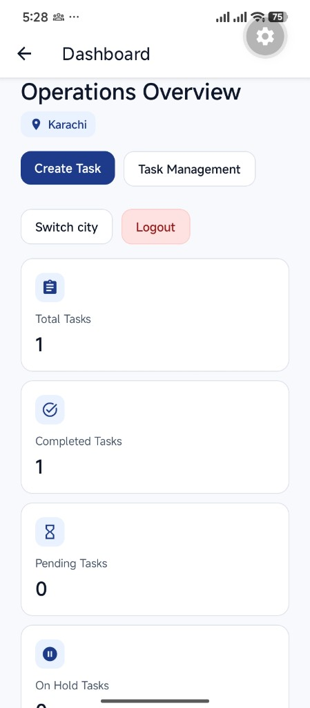

### 6.6 Dashboard — costs by branch

The same dashboard includes **Total Cost (Initial to Current)** and a **Branch overview** list with task counts and PKR totals per branch.

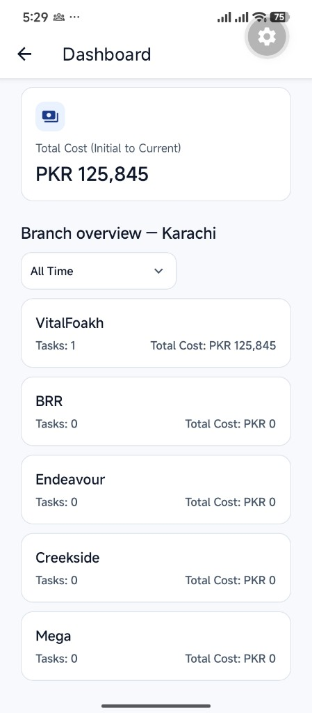

### 6.7 Dashboard — date range filter

Tap the time filter (e.g. **All Time**) to open **Select Date Range**: **All Time**, **Last 7 Days**, **Specific Month**, or **Specific Date**.

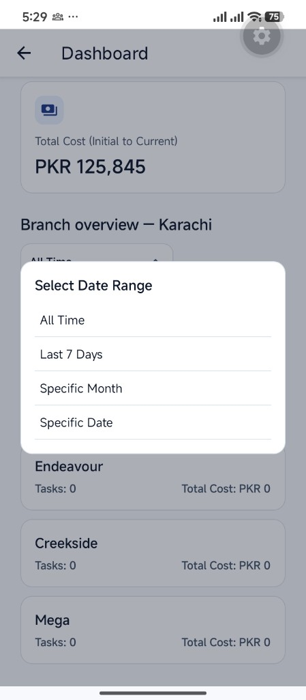

### 6.8 Task Management — search, filters, row actions

Open **Task Management** for Karachi. Search by title or vendor; filter by **branch**, **status**, **month**, and **date**. Each row supports actions such as **View**, **Download**, and **Delete** (with confirmation where configured).

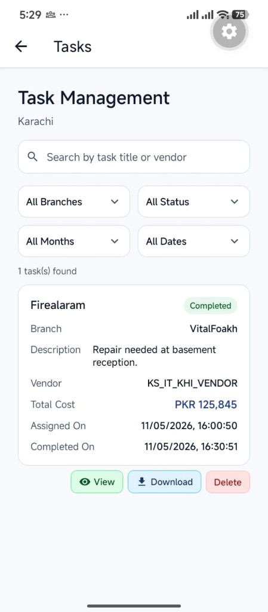

### 6.9 Create Task

Enter **Task title**, **Assigned branch**, **Category**, **Assigned vendor**, and **Description**. The banner reminds you which vendor sees tasks in this city (here **KS_IT_KHI_VENDOR**).

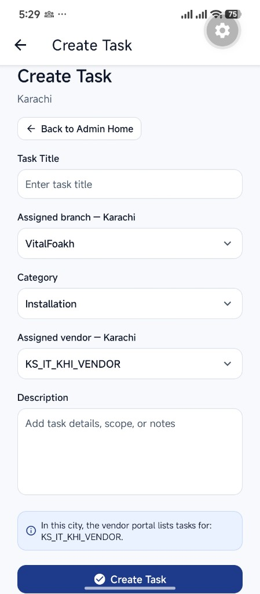

An alternate layout variant (same flow, **Electrical** category) is saved as `screenshots/manual/extra-create-task-electrical.png` for training material.

### 6.10 Task created — confirmation

After submit, a confirmation dialog shows the assignment (example: **Intercom** at branch **BRR** for **KS_IT_KHI_VENDOR**). The vendor will see the task under **My Tasks**.

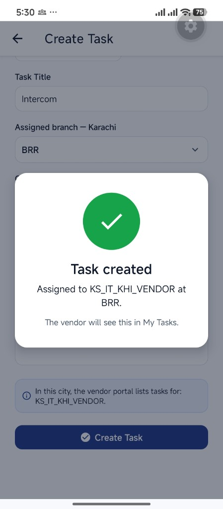

---

## 7. Vendor path — Karachi (same deployment)

### 7.1 Vendor sign-in

Open **Vendor portal** and enter the **city PIN** issued for Karachi (see §4). The device remembers the city until logout, PIN rotation, or reinstall.

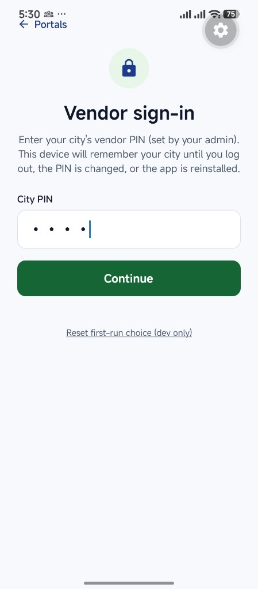

### 7.2 My Tasks — list and branch filter

**My Tasks** shows the vendor code for this city, a **Karachi** badge, **Logout**, and a **Branch filter**. Tasks appear as cards with status, branch, description, **Total Cost**, and timestamps.

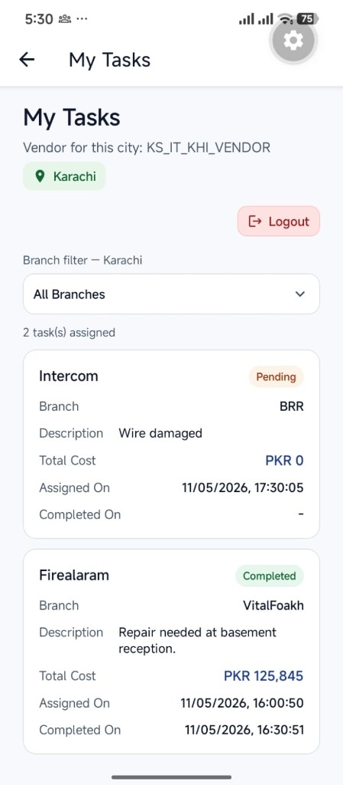

### 7.3 Task detail — Hold

On **Task Detail**, enter **Labour** and **Installation** costs, add comments or photos as required, and review **Current Total**. **Hold** pauses work; the app confirms that admins will see the task as **On Hold** and returns toward **My Tasks**.

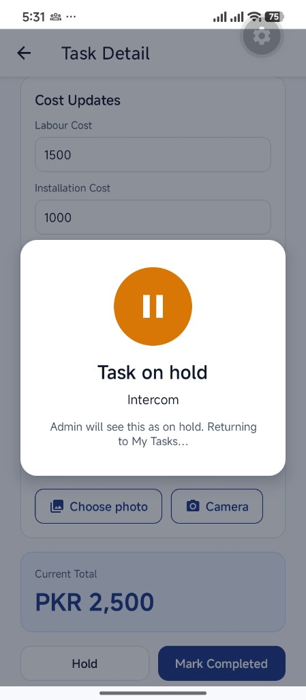

### 7.4 Task detail — Mark completed

**Mark Completed** saves costs and closes the task when policy allows. A success state confirms **Task completed** (example: **Intercom**, costs saved).

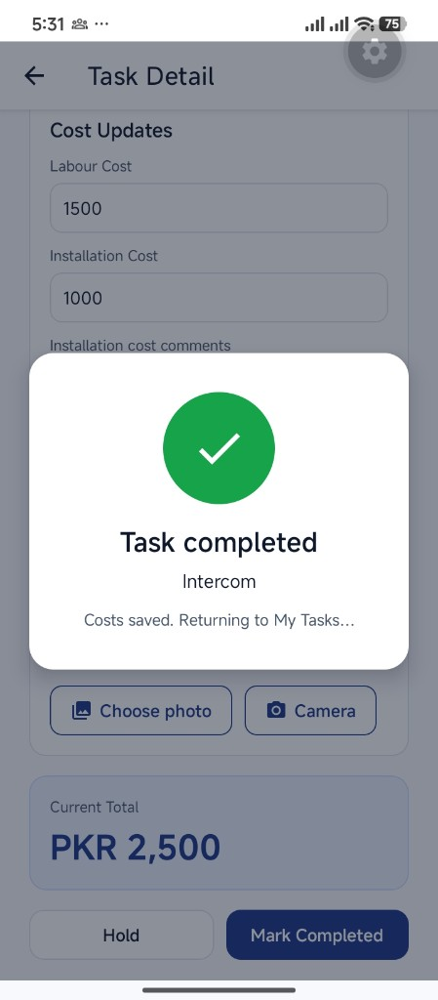

### 7.5 My Tasks — after completion

The task list updates: example **Intercom** at **BRR** shows **Completed**, **PKR 2,500**, and **Extra cost reason** text when provided.

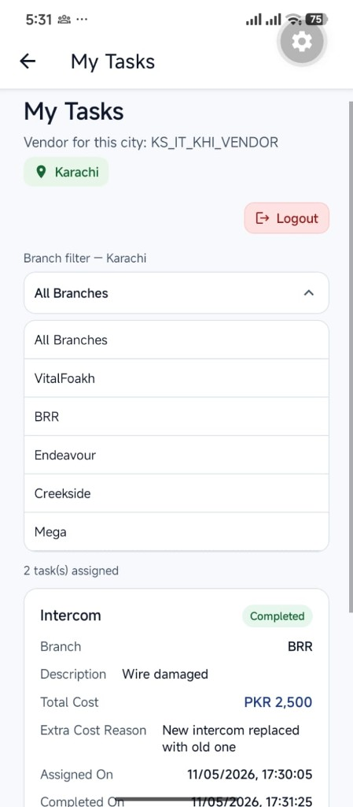

---

## 8. Using both portals on one device

If the device was set up as **Admin & operations**, you can return to the portal picker and open **Vendor portal** to execute work without reinstalling. **Field vendor** installs cannot reach admin screens.

---

## 9. Task statuses & actions (reference)

| Status / action | Meaning |
|-----------------|--------|
| **Pending** | Assigned; work not finished. |
| **On Hold** | Paused by vendor; visible to admin. |
| **Completed** | Closed with saved costs per policy. |
| **Delete** (admin) | Removed when policy allows; usually confirmed in-app. |

---

## 10. Security & PIN hygiene

- **Admin device password** and **vendor city PIN** serve different purposes — do not reuse unrelated passwords.
- Rotating a **vendor PIN** signs vendors out until they use the new PIN — coordinate before changing.
- Lost devices: treat as credential risk; rotate PINs and follow MDM wipe procedures.

---

## 11. Troubleshooting

| Issue | What to try |
|--------|-------------|
| Empty lists | Confirm the correct **city**; pull to refresh; check network/VPN per IT. |
| Admin unlock fails | Verify **device password** (default vs changed); caps lock. |
| Vendor PIN fails | Confirm **city** matches the PIN IT issued (Karachi example in §4). |
| PIN changed unexpectedly | Admins may have rotated the PIN under **Vendor PINs** — use the new PIN. |
| Photo / camera blocked | Grant **camera** and **photos** permissions in system settings. |

---

## 12. Glossary

| Term | Definition |
|------|------------|
| **Branch** | Site within a city (e.g. VitalFoakh, BRR, Clifton). |
| **City PIN** | Vendor credential for a city; managed under Vendor PINs. |
| **Generation** | PIN version; increments when the PIN changes. |
| **Admin portal device password** | Lock for admin features on a specific device. |
| **My Tasks** | Vendor task queue for the signed-in city/vendor. |

---

## 13. Support & escalation

Use your internal IT process for outages or suspected misuse. Note device OS, app version, city, time window, and whether a PIN was recently rotated.

---

## 14. Exporting this manual to PDF

1. Copy device screenshots into `docs/screenshots/manual/` — run **`npm run manual:screenshots`** (or set `MANUAL_SCREENSHOT_SRC` if assets live elsewhere).  
2. Generate PDF: **`npm run manual:pdf`** (prints `docs/Kickstart-Vendor-Hub-User-Manual-Print.html` to `docs/Kickstart-Vendor-Hub-User-Manual.pdf`).  
3. Redact secrets in images before external distribution.

---

## 15. Document control

| Version | Date | Notes |
|---------|------|--------|
| 3.1 | May 2026 | Expanded structure; aligns with professional PDF (cover, TOC, glossary, approvals) |
| 3.0 | May 2026 | Karachi device screenshots |
| 2.0 | — | Prior Lahore narrative |

**Prepared by:** _______________  
**Approved by:** _______________

---

*End of manual*
